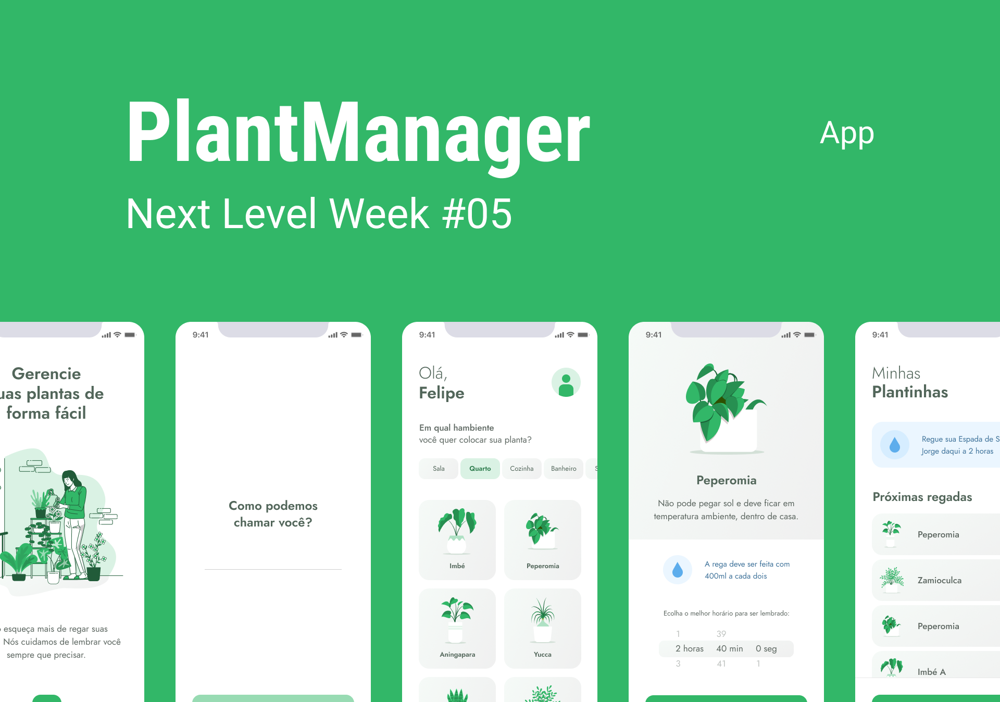

<h1 align="center">
  
</h1>

<p align="center">
  <a href="#-plantmanager">Sobre</a>&nbsp;&nbsp;&nbsp;|&nbsp;&nbsp;&nbsp;
  <a href="#-tecnologias">Tecnologias</a>&nbsp;&nbsp;&nbsp;|&nbsp;&nbsp;&nbsp;
  <a href="#-como-testar">Como Testar</a>&nbsp;&nbsp;&nbsp;|&nbsp;&nbsp;&nbsp;
  <a href="#-licença">Licença</a>
</p>

<p align="center">
  
</p>

# 🍀 PlantManager

O que é o PlantManager? PlantManager é mais uma ideia de aplicativo criada pela equipe da @rockeatseat, através desse app conseguimos treinar diversos conceitos de IU e UX, além de podermos melhorar nossas habilidades em desenvolvimento de apps mobile.

A proposta do app é ajudar você a cuidar melhor de suas plantas, lhe lembrando e notificando de regá-la e informando sobre algumas características especiais de cada uma.😄🍃🌱

# ✨ Tecnologias

# 🚀 Como testar

## Configurando ambiente 

### NodeJs
Primeiro vamos precisar fazer algumas instalações e configurações em sua máquina. A primeira delas é a instalação do [NodeJS](https://nodejs.org/en/) em sua máquina. O processo de instalação é bem simples, só dar next next que é sucesso. 😉

Caso tenha alguma dúvida, ou tenha ocorrido algum erro consulte o próprio site, eles contam com uma excelente documentação e com certeza vão poder te ajudar.

### Expo

Após instalarmos o NodeJs, precisaremos instalar também o [Expo](https://expo.io/), na [documentação](https://docs.expo.io/) deles você pode encontrar todo um tutorial de instalação e configuração em cada ambiente e sistema operacional. Porém basicamente tudo se resume no seguinte comando que deve ser executado em seu terminal: 
```
$ npm install --global expo-cli
```

Depois de instalado você deve instalar o aplicativo Expo Go, disponível em sua loja de aplicativos, é através dele que você poderá executar o app em seu dispositivo físico, mas caso queira gerar uma apk ou um bundle e largar mão do Expo isso também é possível ( e recomendado ) e está disponível o passo a passo na documentação do Expo.

### Json-Server
Por último devemos instalar agora de maneira global o [Json-Server](https://github.com/typicode/json-server). O Json-Server é uma biblioteca open source criada para simular servidores json http, através dele colocaremos um arquivo Json no ar para que nosso aplicativo possa consumir o conteúdo dele. Além disso, a biblioteca conta com várias outras funções disponíveis que podem ser encontradas em sua documentação.

Para instalá-lo você deve executar o seguinte comando em seu terminal:

```
$ npm install -g json-server
```

## Mão na massa

Pronto, agora com tudo instalado chegou finalmente a hora de começar, e a primeira coisa que você deve fazer é fazer um clone desse repositório para sua máquina local. Existem diversas formas de você fazer isso, mas a mais simples dela é baixar um arquivo zip do repositório e descompactá-lo em sua máquina.

Depois de descompactado, você deve navegar até a pasta raiz do seu projeto, pasta essa que conta com um arquivo chamado ```package.json```. Após encontrá-lo execute os seguinte comando: 

```
$ npm install
```

É importante que o comando seja executado dentro do diretório onde o ```package.json``` se encontra, pois é através dele que será instaladas todas as dependências do projeto. 


Agora precisaremos fazer uma pequena alteração dentro do arquivo ```api.ts```, ele pode ser encontrado dentro do diretorio ```src/services/api.ts```. Dentro dele você irá encontrar o seguinte código: 

~~~typescript
import axios from "axios";

const api = axios.create({
    baseURL: "http://192.168.2.108:3333"
});

export default api;
~~~

Você deve alterar o ```baseURL``` para o endereço ip da sua máquina mas deve manter a porta como a 3333, ou seja você só irá alterar a parte que tem o codigo ```192.168.2.108```,
seu código fica da seguinte forma:

~~~typescript
import axios from "axios";

const api = axios.create({
    baseURL: "http://<<SEU IP>>:3333"
});

export default api;
~~~

Após fazer a alteração você deve executar o seguinte comando na pasta raiz do projeto: 

```
$ json-server ./src/services/server.json --host <<SEU IP>> --port 3333 --delay 1250
``` 

Lembre-se de alterar o ```<<SEU IP>>``` pelo endereço ip de sua máquina, ele deve ser o mesmo que consta no arquivo ```api.ts```.

Esse comando será responsável por executar o nosso json-server e subir um servidor com base nos dados que constam no ``` ./src/services/server.json```.

Finalmente agora com o nosso json-server servindo todos os dados que nossa aplicação irá necessitar executaremos nosso último comando.

```
$ expo start
```

Esse comando inicia toda nossa aplicação, após executá-lo aparecerá para você um QR Code o mesmo deve ser lido pelo aplicativo Expo Go instalado anteriormente em seu smartphone, então se tudo tiver corrido bem o aplicativo será iniciado e você finalmente poderá vê-lo em execução em seu dispositivo.

Um outro detalhe que pode ser alterado é a foto de perfil, para alterá-la basta escolher uma foto de seu desejo no formato ```.png```, depois renomeie ela para ```profile.png```. Após realizar esse processo navegue até o diretório ```/src/assets/```, dentro desta pasta você irá substituir o ```profile.png``` pela sua foto.

# 📄 Licença

Esse projeto está sob a licença MIT.
